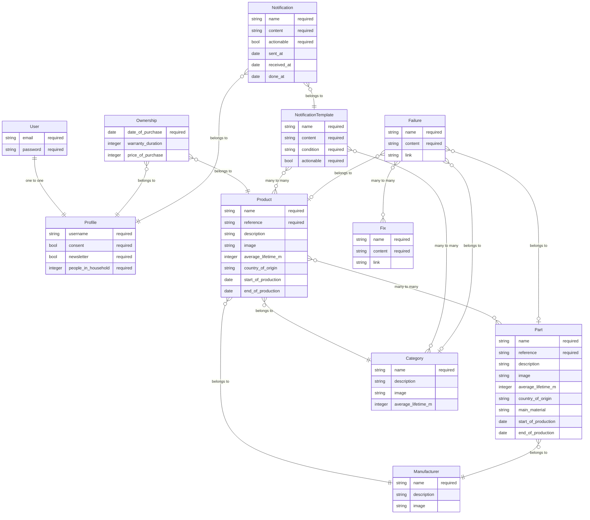

# Database architecture

```mermaid
erDiagram
    User ||--|| Profile: "one to one"
    Ownership }o--|| Profile: "belongs to"
    Ownership }o--|| Product: "belongs to"
    Product }o--|| Manufacturer: "belongs to"
    Part }o--|| Manufacturer: "belongs to"
    Product }o--|| Category: "belongs to"
    Product }o--o{ Part: "many to many"
    NotificationTemplate }o--o{ Category: "many to many"
    NotificationTemplate }o--o{ Product: "many to many"
    Notification }o--|| NotificationTemplate: "belongs to"
    Notification }o--|| Profile: "belongs to"
    Failure }o--o| Category: "belongs to"
    Failure }o--o| Product: "belongs to"
    Failure }o--o| Part: "belongs to"
    Failure }o--o{ Fix: "many to many"

    User{
        string email "required"
        string password "required"
    }

    Profile{
        string username "required"
        bool consent "required"
        bool newsletter "required"
        integer people_in_household "required"
    }

    Ownership{
        date date_of_purchase "required"
        integer warranty_duration
        integer price_of_purchase
    }

    Product{
        string name "required"
        string reference "required"
        string description
        string image
        integer average_lifetime_m
        string country_of_origin
        date start_of_production
        date end_of_production
    }

    Category{
        string name "required"
        string description
        string image
        integer average_lifetime_m
    }

    Manufacturer{
        string name "required"
        string description
        string image
    }

    Part{
        string name "required"
        string reference "required"
        string description
        string image
        integer average_lifetime_m
        string country_of_origin
        string main_material
        date start_of_production
        date end_of_production
    }

    NotificationTemplate{
        string name "required"
        string content "required"
        string condition "required"
        bool actionable "required"
    }

    Notification{
        string name "required"
        string content "required"
        bool actionable "required"
        date sent_at
        date received_at
        date done_at
    }

    Failure{
        string name "required"
        string content "required"
        string link
    }

    Fix{
        string name "required"
        string content "required"
        string link
    }

    %% Context Product
    %%    Product
    %%    Category
    %%    Manufacturer
    %%    Part

    %% Context Account
    %%    User

    %% Context Profile
    %%    Profile
    %%    Ownership

    %% Context Failure
    %%    Failure
    %%    Fix

    %% Context Notification
    %%    Notification
    %%    NotificationTemplate
```
